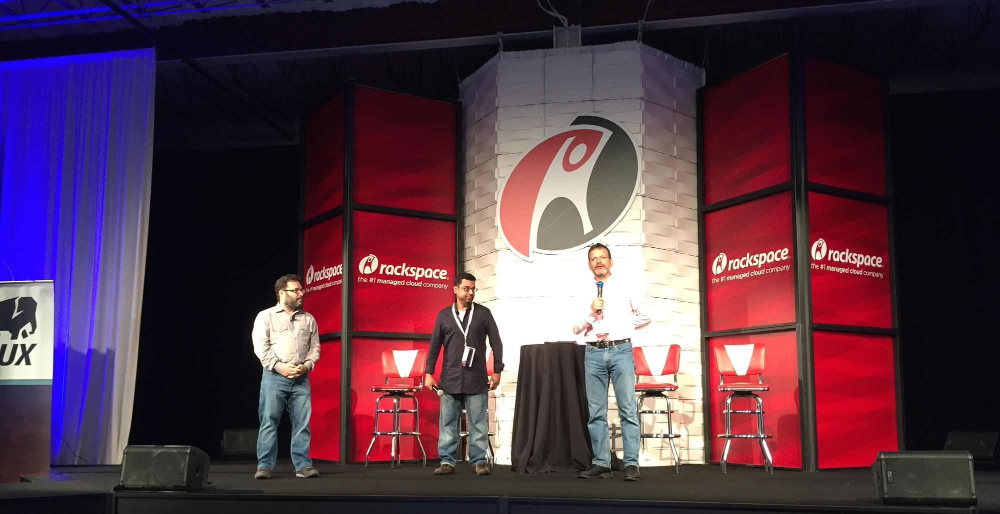
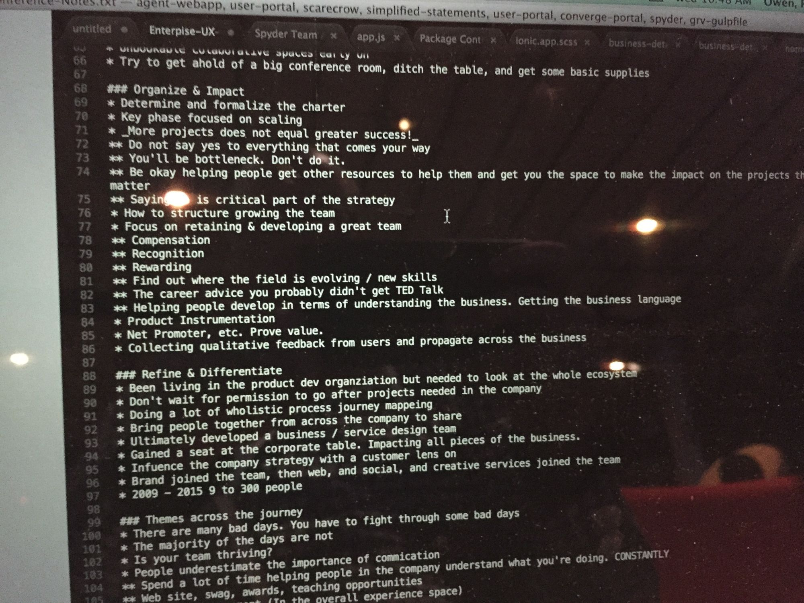

I'm fresh back from San Antonio with my head swimming in ideas. I've had the
fortune of attending some pretty amazing conferences about user experience and
web technology, but never did one hit as close to home as this one. And it
wasn't just about the speakers -- who were amazing -- it was also about being in
a room with hundreds of others who spoke my language and shared my business
challenges.

San Antonio Riverwalk

Enterprise UX 2015 [http://enterpriseux.net], was the first such conference I've
been to that focused squarely on the benefits and challenges of working in the
enterprise as opposed to consumer-facing products. Based on this event, I'm
certain that many others will follow. There is a deep need in the enterprise to
equip practitioners with skills, both soft and hard, that are unique to the
environment.

Here are a few of the most common challenges I saw:

- Getting the buy-in of senior leadership.
- Communicating the need for and value of user experience across entrenched
  silos in the organization.
- Being customer centered by actually bringing the customer into design and
  production. Even for internally facing products.
- Making user experience results easy to act on in the business.
- Recruiting for User Experience roles.
- Bring in development talent and collaborating deeply.
- Making UX work amidst Agile & Lean practices.
- Dealing with complicated process and regulation.
- Getting access to enterprise customers and users for user research.
- Establishing user experience KPIs.

I feel renewed. I don't have the answers for all of these. But I've got success
stories and frameworks now that show me these challenges can be tackled. I'm
excited to make it happen!

Please reach out if you want chat about strategy and/or tactics for any of these
issues.

Enterprise UX Opening Presentation

Photo of notes on computer from Enterprise UX
