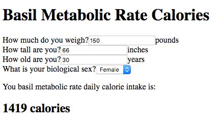

React and Redux have done a lot to make the idea of [unidirectional data flow](https://redux.js.org/basics/dataflow) popular amongst JavaScript front-end
developers like me. But the roots of this pattern go much deeper. To explore
that, I decided to implement a small calculator project using two different
technologies that ultimately produce a JavaScript Single Page Application and
get a sense of the strengths and weaknesses of these tools.

## The Project

The project is a simple continuously updating calculator that can show you your
expected [Basil Metabolic Rate](https://en.wikipedia.org/wiki/Basal_metabolic_rate) given some simple
measurements. There are all kinds of formula for this but I chose the [Mifflin –
St Jeor Formula found here](https://www.freedieting.com/calorie-needs) because
it provided a simple enough calculation. I needed to modify the model slightly
so I could take inputs using US Customary Units rather than SI Units.

The end result is a mostly unstyled web page with a few form fields that, when
changed by the user, will recalculate and display the expected basil metabolic
rate.


Screen capture of the Basil Metabolic Rate Calculator

## Cycle JS

[Run the demo here](https://onetruebob.github.io/metabolic-calculators/cycle.html)

I made [my first implementation](https://github.com/onetruebob/calorie-count-cycle) using the [Cycle.js](https://cycle.js.org/) framework. Cycle.js is
a super-minimal framework for creating apps by using reactive streams to create
a one-way data flow. The framework itself is unopinionated to the point where it
is basically just a hybrid abstraction of a function that takes data changes as
input and produces DOM changes as output.

If you aren't familiar with the pattern of reactive data streams -- for which
there are several common JavaScript implementations -- I recommend starting with
the [venerable functional reactive programming tutorial found here](http://reactivex.io/learnrx/).

I created the crux of my calculator implementation in the single function `main`
from the `app/index.js` file [found here](https://github.com/onetruebob/calorie-count-cycle/blob/master/app/index.js).

The first few lines (11 - 25) establish hooks into the various page form
elements to get new values from the form as they change.

```javascript
//-- Intent
const changeWeightInLbs$ = sources.DOM.select("#weight-in-lbs")
  .events("input")
  .map(ev => parseFloat(ev.target.value) || 0)

const changeHeightInInches$ = sources.DOM.select("#height-in-inches")
  .events("input")
  .map(ev => parseFloat(ev.target.value) || 0)

const changeAgeYears$ = sources.DOM.select("#age-in-years")
  .events("input")
  .map(ev => parseFloat(ev.target.value) || 0)

const changeSex$ = sources.DOM.select("#sex")
  .events("change")
  .map(ev => ev.target.value)
```

Following that, I combine these streams to feed data into the model and get back
out the expected basil metabolic rate on lines 34 - 36.

```javascript
//-- Model
const state$ = xsHelpers
  .combineStreams(weightInLbs$, heightInInches$, ageYears$, sex$)
  .map(combindedValues => calorieModel(combindedValues))
```

And finally on lines 39 - 72, I use cycle's snabdom to generate the virtual DOM
to write the changes back to the HTML.

```javascript
//-- View
const vdom$ = state$.map(model =>
  div([
    div(".calc-section.calc-title", [h1("Basil Metabolic Rate Calories")]),
    div(".calc-section.calc-inputs", [
      div(".calc-input", [
        label({ attrs: { for: "weight-in-lbs" } }, "How much do you weigh?"),
        input("#weight-in-lbs", {
          attrs: { type: "number", value: model.weightInLbs, size: 4 },
        }),
        span(".calc-input-units", "pounds"),
      ]),
      div(".calc-input", [
        label({ attrs: { for: "height-in-inches" } }, "How tall are you?"),
        input("#height-in-inches", {
          attrs: { type: "number", value: model.heightInInches, size: 4 },
        }),
        span(".calc-input-units", "inches"),
      ]),
      div(".calc-input", [
        label({ attrs: { for: "age-in-years" } }, "How old are you?"),
        input("#age-in-years", {
          attrs: { type: "number", value: model.ageYears, size: 4 },
        }),
        span(".calc-input-units", "years"),
      ]),
      div(".calc-input", [
        label({ attrs: { for: "sex" } }, "What is your biological sex?"),
        select(
          "#sex",
          { attrs: { required: "required" } },
          sexOptions.map(sex => {
            return option(
              {
                attrs: {
                  value: sex,
                  selected: model.sex === sex ? "selected" : "",
                },
              },
              sex
            )
          })
        ),
      ]),
    ]),
    div(".calc-section.calc-results", [
      p("You basil metabolic rate daily calorie intake is:"),
      h2(".calc-result", `${model.calorieNeeds} calories`),
    ]),
  ])
)
```

What I love about the Cycle.js approach is that, if you're familiar with the
idea of functional reactive programming, then this approach from Cycle.js is
pretty easy to write and generally produces very small, performant code with a
relatively simple composition model. And if you don't quite have your head
around it yet the creator of Cycle.js, André Staltz, has done a [ton of talks
that can help](https://www.google.com/search?q=Andr%C3%A9+Staltz+cycle+js+talks&oq=Andr%C3%A9+Staltz+cycle+js+talks&aqs=chrome..69i57.3890j0j7&sourceid=chrome&ie=UTF-8)
.

The downside of Cycle JS compared to a more full-featured framework such as
React is that you have to manage a lot of the wiring and basics yourself. For
example, the main function started with creating hooks into the source to
monitor for changes to the form values. That works great for this simple example
but could begin to feel like managing a lot of boilerplate code in larger
projects where in addition to setting up listeners for you also get niceties
like such as routers.

Still, the benefits of this unidirectional data flow are clear. It's
straightforward to trace back an element displayed on the page to the source
data that created it.

## Elm

[Run the demo here](https://onetruebob.github.io/metabolic-calculators/elm.html)

I made [my second calculator implementation](https://github.com/onetruebob/calorie-count-elm) using the [Elm programing
language](http://elm-lang.org/).

It feels like the premise of Elm is to answer the question "What would happen if
we made a programming language specifically to enshrine the concept of
functional reactive programming?" It's a functional programming language that
compiles down to javascript to run on the browser. Once you successfully compile
your project you know it will run and won't be plagued by issues such as runtime
exceptions.

I created the whole of my Elm implementation of my Basil Metabolic Rate
calculator in the [single file at the root of the project](https://github.com/onetruebob/calorie-count-elm/blob/master/calorie-calc.elm)
`calorie-calc.elm`.

If you're unfamiliar with Elm, it can look a little foreign and verbose. But
just like the Cycle JS implementation, it is broken up into three pieces:

- The model that describes the state of the calculators (lines 13 - 22)
- The update messages that describe how to change the model when the user or
  system take action (lines 25 - 71)
- The view which describes how the dom should look based on the model (lines 74
  - 102)

All of these feed into the Elm runtime which does the magic of tying these three
pieces together.

What I love about the Elm solution is that, in exchange for being very detailed
about the shape of all the data and functions used in your program, you can be
completely confident that your program won't fail because of a runtime
exception. Additionally, the Elm approach forces you to provide a
well-structured solution.

The trick with Elm is that, to use it and understand what you are doing, you
have to go pretty far into the functional programming rabbit hole. I think its a
completely worthwhile exercise that will pay dividends to the code you write in
any language. But the journey is not easy. I'm still learning new things about
functional programming all the time.

If you're starting out with functional programming, I highly recommend looking
into [Professor Frisby's Mostly Adequate Guide to Functional Programming](https://github.com/MostlyAdequate/mostly-adequate-guide) which will help you
level up using the JavaScript skills you already have.
