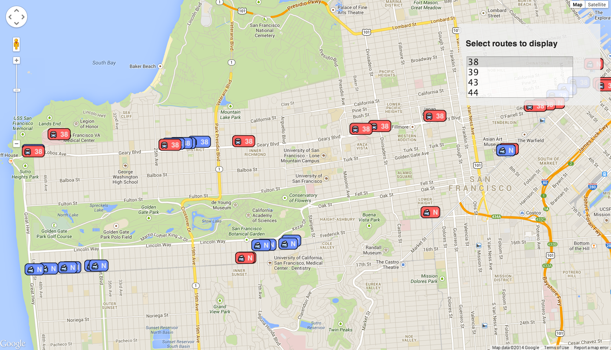

Just two weeks into my stint at Hack Reactor and my confidence in my programming
skill is growing. So much so that I've already started using them to solve my
own problems. Problems like, when should I leave to catch the train?

My roommates an I live about an hour away from Hack Reactor on the N Judah Muni
train line. It's really a super convenient way to travel in San Francisco,
however while the trains might say they have a schedule, the reality is that
they run whenever they want. And backups, slowdowns, strikes, and the like can
mean long waits for the next train in the morning chill.

After cruising around, I found a web app called Live Bus that can show the live
location of all the Muni buses and trains in San Francisco
http://www.sflivebus.com/

The problem is, this app shows all buses and trains on all routes at once.
That's hundreds of vehicles making it harder to find the ones I care about. I
want to only see where the buses and trains I cared about were.

My roommate noticed the page had a \"fork this on GitHub\" link and said I ought
to fix it. So I did.

Now I have an app where I can select to see just the routes I want, and the app
remembers those selections from run to run using local storage.

Here's my fork:
https://github.com/onetruebob/firebus/tree/route-selection

~~You can play with it yourself here (assuming they keep serving the location database)~~:
http://whereismuni.bobowen.org/

**2017 Update:** Firebase is no longer serving the underlying data for this.
